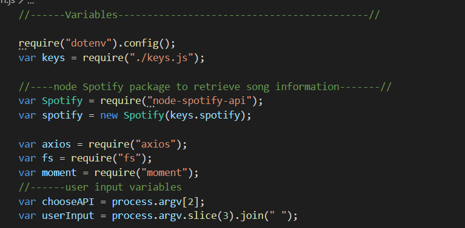

# LIRI-NODE-APP

LIRI is a *Language Interpretation and Recognition Interface*.  It is a command line node app that takes a user's input, retrieves the requested data, and displays it back to the user.  LIRI sends requests using the ```axios``` package

* Bands in Town API (used for concerts)
* OMDB (movies)
* Spotify(songs)  

LIRI also will use the ```dotenv``` package to set variables specific to the computer running node, keeping the API keys private for Spotify, using ```.gitignore``` as well.  LIRI will also use the ```moment``` package to format dates in the concert search.

# Overview

The LIRI app uses four main commands: 

* ```concert-this``` (searches Bands in Town API)
* ```spotify-this-song``` (searches Spotify API)
* ```movie-this``` (searches OMDB API)
* ```do-what-it-says``` (runs the command and search item in ```random.txt``` file)

Using the command line, I navigated to the correct repository and run ```npm install```, which installs the necessary code packages needed for LIRI.  I also ran ```npm init -y```, which created the ```package.json``` file that is needed for third party npm packages.  There is also 2 text files: ```random.txt``` and ```log.txt```.  The ```liri.js``` file contains the Javascript code. 

# Liri.js

**Variables**



* ```chooseAPI``` variable takes user input for chosen command, which will be 2nd argument in array
* ```userInput``` variables takes user input for search item, 3rd in array

**Switch-case Statement**


* switch-case statement switches between functions and runs them
* also runs default searches if ```userInput``` is blank and program is ran

**Concert-This Function** 


* uses ```axios``` package to retrieve data from *Bands in Town API*
* for loop to loop through response, retrieves requested artist/band input and displays:
    * Artist/Band
    * Venue
    * Location
    * Date

**Spotify-This-Song Function**


* searches *track* information from *Spotify API*, limited to 10 results
* retrieves requested song title input and displays:
    * Artist/Band
    * Song Title
    * Album Name
    * Preview Link


